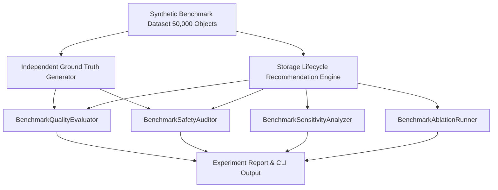

# Experiment & Benchmark Framework

> [!NOTE]
> **REPRODUCIBILITY NOTICE**: The experiment framework allows reproducible, automated evaluation of recommendation accuracy, safety preservation, policy sensitivity, and information ablation.

---

## 1. Core Architecture & Evaluator Services

The benchmark framework is implemented in `backend/app/services/industry_experiment.py` and consists of four independent evaluator components:



### 1. `BenchmarkQualityEvaluator`
Compares engine outputs against independent ground truth:
- **Metrics**: Overall Accuracy, Macro Precision, Macro Recall, Macro F1 Score.
- **Confusion Matrix**: Full $6 \times 6$ matrix across `KEEP`, `INFREQUENT_ACCESS`, `ARCHIVE`, `DELETE_CANDIDATE`, `HOLD`, `REQUIRES_REVIEW`.
- **Per-Action Metrics**: Detailed breakdown for high-risk actions (`DELETE_CANDIDATE`, `ARCHIVE`, `HOLD`).

### 2. `BenchmarkSafetyAuditor`
Audits safety preservation across all recommendations:
- **Legal Hold Violations**: Any `DELETE_CANDIDATE` on an object with an active legal hold.
- **Retention Duration Violations**: Any `DELETE_CANDIDATE` prior to retention expiration.
- **High Restore Risk Flagging**: Unflagged archival recommendations on high-restore-frequency data.
- **Pass Criteria**: Required $\mathbf{0}$ safety violations for benchmark `PASS`.

### 3. `BenchmarkSensitivityAnalyzer`
Evaluates how recommendation volume and accuracy shift across parameter variations:
- Archive Age Thresholds: 180 days, 270 days, 365 days.
- Access Thresholds: 0 accesses, 1 access, 5 accesses.

### 4. `BenchmarkAblationRunner`
Simulates removing specific evidence sources without modifying production code:
- **Ablation 1 (No Restore Telemetry)**: Simulates missing restore frequency data.
- **Ablation 2 (No Access Telemetry)**: Simulates missing access log evidence.
- **Ablation 3 (No Legal Hold Context)**: Simulates missing governance integration.

---

## 2. Command Line Interface (CLI)

Run single-seed benchmark experiment:
```bash
python -m app.scripts.run_industry_experiment --dataset validation --seed 42
```

Run multi-seed statistical evaluation:
```bash
python -m app.scripts.run_industry_experiment --multi-seed
```

Export dataset metadata to CSV / JSONL:
```bash
python -m app.scripts.export_dataset --format csv --output dataset_export.csv
```

---

## 3. Benchmark API Endpoints

The framework exposes REST endpoints under `/api/v1/benchmark`:
- `GET /api/v1/benchmark/summary`: Dataset scale & cost reduction KPIs.
- `GET /api/v1/benchmark/quality`: Accuracy, macro F1, confusion matrix, per-action metrics.
- `GET /api/v1/benchmark/safety`: Safety audit result & violation counters.
- `GET /api/v1/benchmark/sensitivity`: Sensitivity analysis table.
- `GET /api/v1/benchmark/ablation`: Information ablation impact table.
